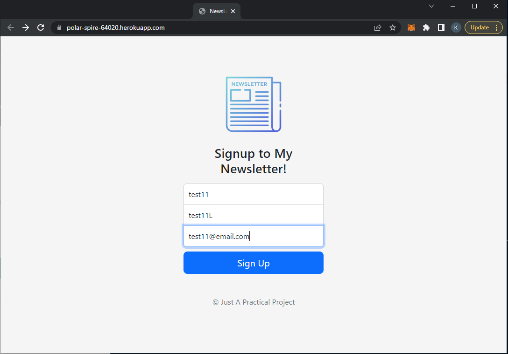
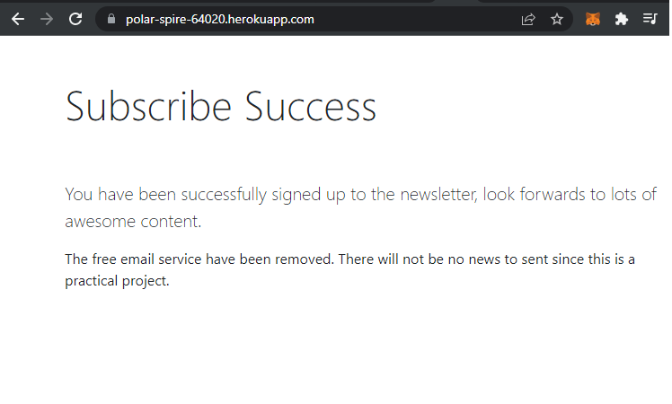
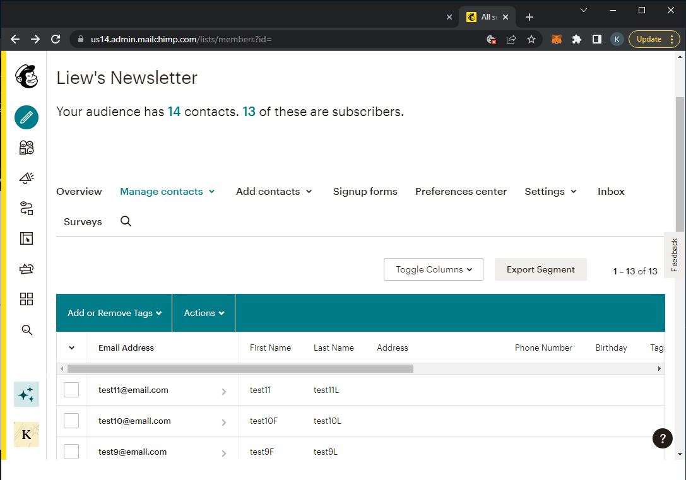

# Newsletter-Signup
> A simple express web server that allow people to subsribe a email newsletter
> Live demo [Heroku](https://polar-spire-64020.herokuapp.com/) another alternative is available on [Render](https://newsletter-signup-lh8y.onrender.com). Both is running on free-tier plan.
## Table of Contents
* [General Info](#general-information)
* [Technologies Used](#technologies-used)
* [Features](#features)
* [Screenshots](#screenshots)
* [Setup](#setup)
* [Usage](#usage)
* [Project Status](#project-status)
* [Lesson Learned](#lesson-learned)
* [Room for Improvement](#room-for-improvement)
* [Acknowledgements](#acknowledgements)
* [P.S.](#postscript)


## General Information
- An express web server provide email newsletter subcription service.
- The newsletter service is powered by MailChimp
- The free mailing service had been terminated by MailChimp
- There will be no newsletter to send since this is a practical project


## Technologies Used
- Express: ^4.18.1
- dotenv: ^16.0.2
- Node: ^14.17.6
- mailchimp_marketing: ^3.0.78


## Features
- Subsribe to a newsletter


## Screenshots
- Webpage



- Success subscribe



- Record made




## Setup
- Project Environment
    - [Node.js](https://nodejs.org/en/) installed
- Create an free account on [Mailchimp](https://mailchimp.com/)
- Add an .env file in the root directory with the following variables provided by [Mailchimp documentation](https://mailchimp.com/developer/marketing/guides/quick-start/):
    - MY_API_TOKEN=YOUR-API-TOKEN-FROM-MAILCHIMP
    - SERVER=THE-SERVER-PREFIX-OF-YOUR-ACCOUNT(exmaple: "us1X")


## Usage
- On project terminal
    - install dependencies `npm install`
    - start the app `npm app.js`


## Project Status
Project is: _complete_


## Lesson Learned
- Understanding the outdated API documentation
- And trying to implement the knowledge to the latest version API
- Trial and error to send the request correctly and specifically
- Experience how to interact with API
- Experience in newsletter emailing service
- Push local repository to heorku hosting
- Experience in hosting website
- Learn new platform to host other than heroku
- Implementing dotenv package to hide sensitive information
- Use .gitignore to avoid pushing sensitive file to local repository


## Room for Improvement
- Implement a working email newsletter service instead.
- Be able to send a welcome letter to subscribers.

To do:
- Add another alternative live demo on other platform


## Acknowledgements
- This project was inspired by Angela Yu.
- This project was based on [this course](https://www.udemy.com/course/the-complete-web-development-bootcamp/) on Udemy.


## Postscript
- Side Note for **Heroku Firstimer** <sub>Although Heroku have announced they will no longer provide free tier service, but it still worth to be mentioned</sub>
- Heroku is a hosting website that provide 5 projects for free per account
1. How to deploy your express server on heroku?
    - Go to [Heroku devcenter page](https://devcenter.heroku.com), choose the language that you used to develop your project. 
    - Download the **Heroku CLI** regarding to your **operating system**.
1. Then go to your ***cmd*** or command shell type the command
heroku login
    - Then login with your account email and password
    - In order to check whether you have install heroku correctly, type the command `heroku --version`
1. ***1. You may choose to clone their template library by executing***
    - `git clone https://github.com/heroku/node-js-getting-started.git`
    - Don't forget to change your directory to node-js-getting-started `cd node-js-getting-started`
    
    ***2. Or you may choose to use your own project to start with***
    - In order to make sure your project will compatible with heroku port setting
    - Since we are using express.js to run our server 
    - `process.env.PORT` should be added to the app.listen
    - example:
```javascript
app.listen(process.env.PORT || 3000, function(){
	console.log("Server is running on port 3000");
})
```

4. Procfile
    - This is the file that define what command should be executed to start your app create a file goes by the name of Procfile without any extension
    - add the command to run your server: `web: node app.js`

1. In your command prompt cd to the project file directory
    - getting start to initiate git
```javascript
git init
git add .
git commit -m "The message of this commit"
```
6. Then you upload and deploy your app
    - In order to create your app, you're required to have a dedicated library to store your project
    - Execute `heroku create` in your command prompt to create a heroku project

7. Finally you can push your git online
    - `git push heroku master`