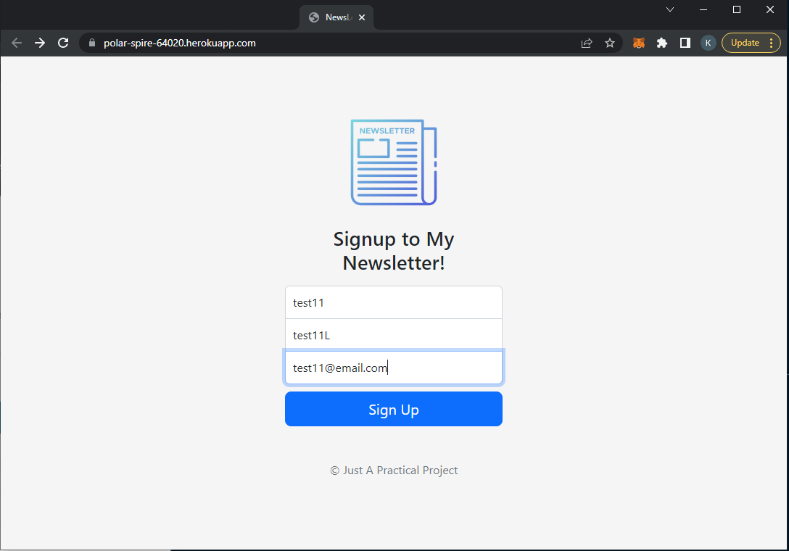
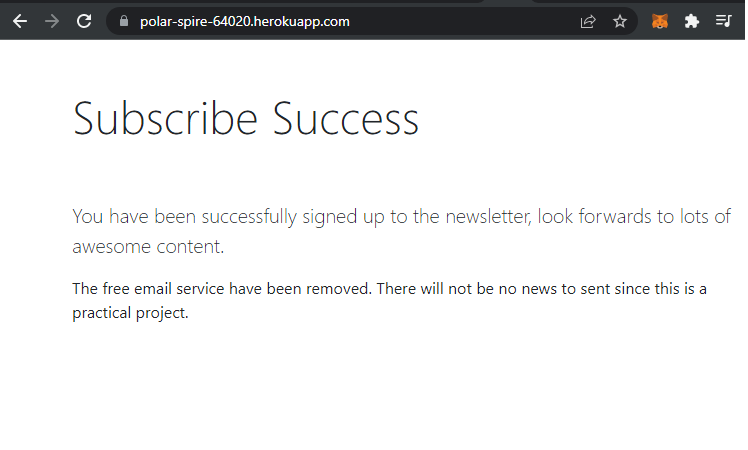
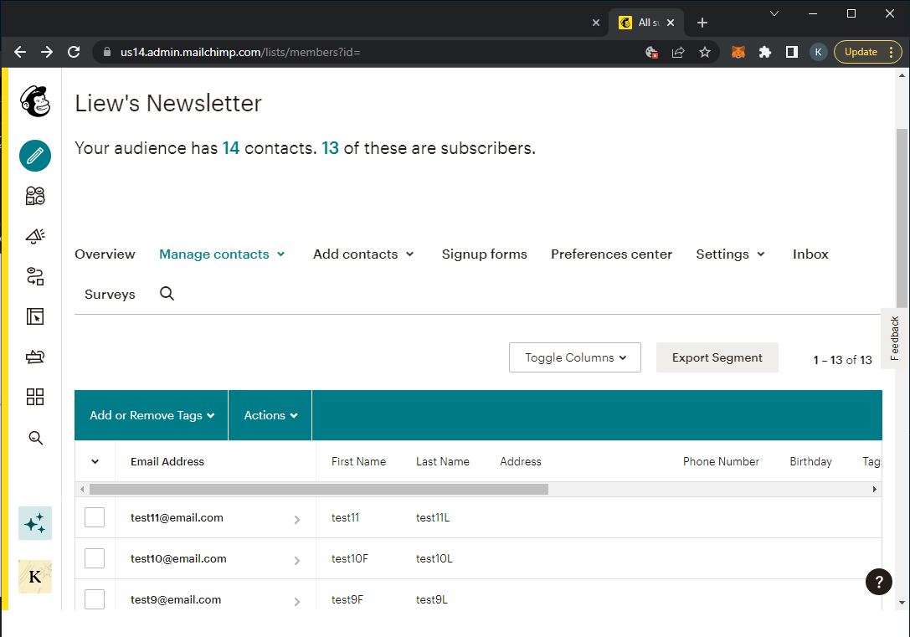

# Newsletter-Signup
[What the project does](#project-description)
[Technology Involved](#technology-involved)
[Usage](#usage)
[Lesson Learned](#lesson-learned)
[Preview](#preview)

# Project Description
- A simple express web server that allow people to subsribe a email newsletter
- The newsletter service is powered by MailChimp
- It has terminated the free mailing service
- There will be no newsletter to send since this is a practical project

# Technologies Involved
- Express: ^4.18.1
- dotenv: ^16.0.2
- Node: ^14.17.6
- mailchimp_marketing: ^3.0.78

# Usage
1. Install dependencies: 
```
    npm install
    npm install @mailchimp/mailchimp_marketing
    npm install dotenv --save
```
2. Create an free account on Mailchimp
3. Add an .env file in the root directory with the following variables:
    - MY_API_TOKEN=YOUR-API-TOKEN-FROM-MAILCHIMP
    - SERVER=THE-SERVER-PREFIX-OF-YOUR-ACCOUNT(exmaple: "us1X")
4. Run server: note app.js
- NOTE: An alternative way to test the web app via [Heroku](https://polar-spire-64020.herokuapp.com/)

# Lesson Learned
- Understanding the outdated API documentation
- And trying to implement the knowledge to the latest version API
- Trial and error to send the request correctly and specifically
- Experience in newsletter emailing service
- Push local repository to heorku hosting
- Experience in hosting website
- Implementing dotenv package to hide sensitive information

### Side Note for **Heroku Firstimer**
- Heroku is a hosting website that provide 5 projects for free per account
1. How to deploy your express server on heroku?
    - Go to [Heroku devcenter page](devcenter.heroku.com), choose the language that you used to develop your project. 
    - Download the **Heroku CLI** regarding to your **operating system**.
1. Then go to your ***cmd*** or command shell type the command
heroku login
    - Then login with your account email and password
    - In order to check whether you have install heroku correctly, type the command `heroku --version`
1. 1. You may choose to clone their templet library by executing
    - `git clone https://github.com/heroku/node-js-getting-started.git`
    - Don't forget to **change your directory** to node-js-getting-started `cd node-js-getting-started`
    
    2. Or you may choose to use your own project to start with
    - In order to make sure your project will compatible with heroku port setting
    - Since we are using express.js to run our server 
    - `process.env.PORT` should be added to the app.listen
    - example:
```
app.listen(process.env.PORT || 3000, function(){
	console.log("Server is running on port 3000");
})
```

4. Procfile
    - This is the file that define what command should be executed to start your app create a file goes by the name of Procfile without any extension
    - add the command to run your server: `web: node app.js`

1. In your command prompt cd to the project file directory
```
getting start to initiate git
git init
git add .
git commit -m "The message of this commit"
```
6. Then you upload and deploy your app
    - In order to create your app, you're required to have a dedicated library to store your project
    - Execute `heroku create` in your command prompt to create a heroku project

7. Finally you can push your git online
    - `git push heroku master`

# Preview
- Webpage



- Success subscribe



- Record made


